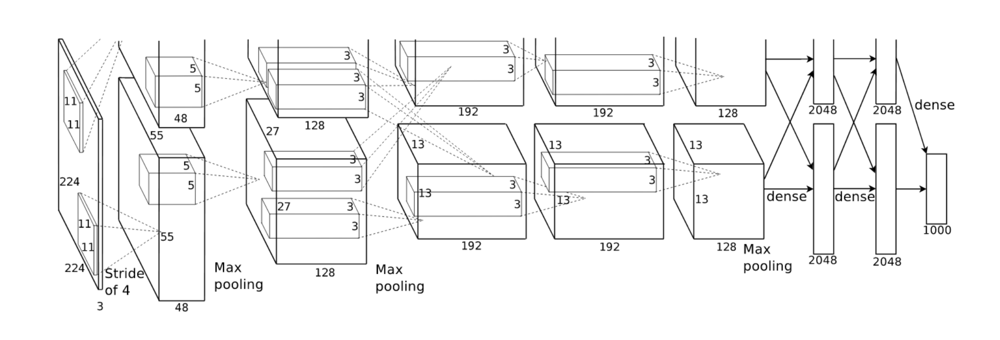
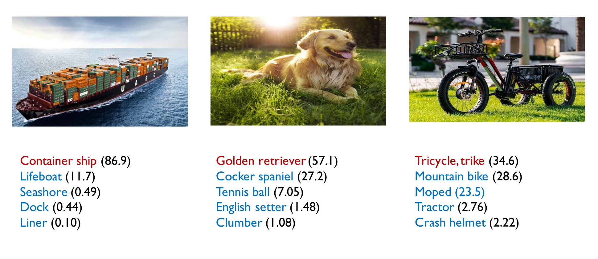
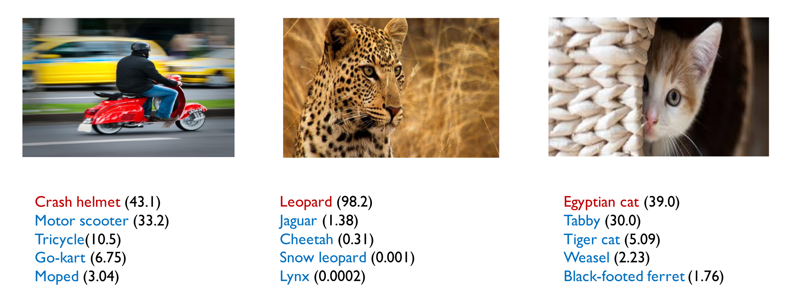

# ImageNet training in PyTorch

This implements training of popular model AlexNet on the ImageNet dataset.

## Requirements

- Install PyTorch ([pytorch.org](http://pytorch.org))
- Download the ImageNet dataset from http://www.image-net.org/
    - Then, and move validation images to labeled subfolders, using [the following shell script](https://raw.githubusercontent.com/soumith/imagenetloader.torch/master/valprep.sh)

## Training

To train a alexnet model, run `train.py` with the desired model architecture and the path to the ImageNet dataset:

```bash
python3 train.py -p 10 -b 256 --epochs 10 /scratch/sudheer.achary/Imagenet-orig/ [imagenet-folder with train and val folders]
```

## Usage

```
usage: main.py [-h] [-j N] [--epochs N] [--start-epoch N] [-b N]
               [--lr LR] [--momentum M] [--weight-decay W] [--print-freq N]
               [--resume PATH] [-e] [--pretrained][--seed SEED]
               DIR

PyTorch ImageNet Training

positional arguments:
  DIR                   path to dataset

optional arguments:
  -h, --help            show this help message and exit
  -j N, --workers N     number of data loading workers (default: 4)
  --epochs N            number of total epochs to run
  --start-epoch N       manual epoch number (useful on restarts)
  -b N, --batch-size N  mini-batch size (default: 256), this is the total
                        batch size of all GPUs on the current node when using
                        Data Parallel or Distributed Data Parallel
  --lr LR, --learning-rate LR
                        initial learning rate
  --momentum M          momentum
  --weight-decay W, --wd W
                        weight decay (default: 1e-4)
  --print-freq N, -p N  print frequency (default: 10)
  --resume PATH         path to latest checkpoint (default: none)
  -e, --evaluate        evaluate model on validation set
  --pretrained          use pre-trained model
  --seed SEED           seed for initializing training.
```

## Results




